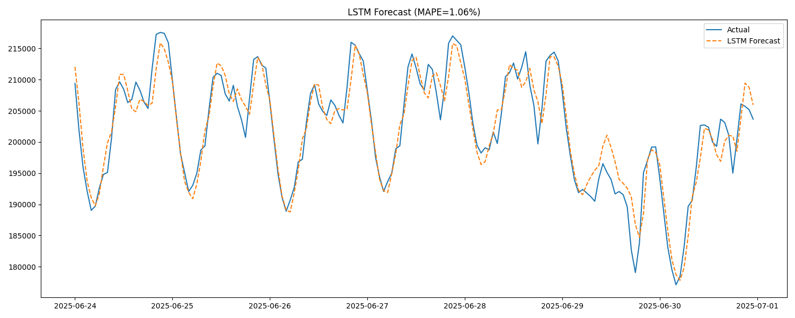
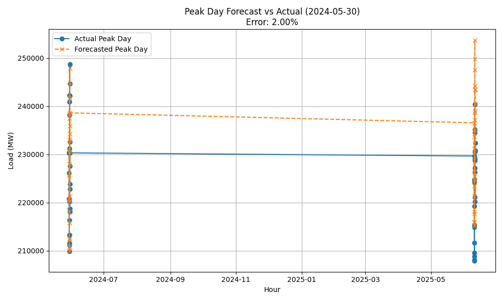
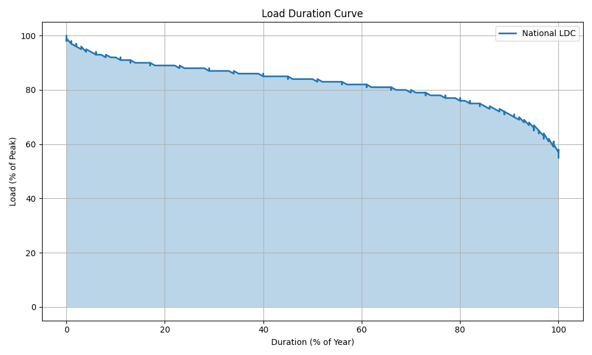

# Electrical Load Forecasting & Grid Analytics Framework

## Project Overview
This repository implements a production-grade forecasting and analytics pipeline for electrical power systems. Using real-world data from the Intelligent Climate & Energy Database (ICED) by NITI Aayog, the project focuses on accurate long-term demand forecasting, short-term peak stress analysis, and grid capacity utilization metrics.

The core objective is to compare statistical (SARIMA) and deep learning (LSTM) approaches for modeling complex load profiles while enforcing strict software engineering standards for reproducibility and scalability.

## Why This Project Matters
Accurate load forecasting is the backbone of modern power grid operations. As grids integrate more renewable energy sources and face increasing demand variability, the cost of forecasting errors rises significantly.
- **Under-forecasting** risks blackouts and grid instability during peak hours.
- **Over-forecasting** leads to wasted generation capacity and higher operational costs.

This project provides a rigorous framework for benchmarking forecasting models and analyzing critical grid characteristics like the Load Duration Curve (LDC).

## Datasets Used
All data is sourced from NITI Aayog's ICED portal.

1. **Yearly Hourly National Demand**
   - Contains hourly power demand (MW) for a full year.
   - Used for training long-term forecasting models (SARIMA, LSTM).

2. **Peak-Day Hourly Demand**
   - High-resolution hourly profiles for specific "stress days" (historical peak load days).
   - Used to validate the model's ability to handle extreme events.

3. **Load Duration Curve (LDC)**
   - Represents the cumulative frequency of demand levels over a year.
   - Used to calculate Base Load vs. Peak Load requirements.

## Methodology

### 1. Data Engineering
The pipeline begins with a robust ETL (Extract, Transform, Load) layer.
- **Schema Validation**: Enforces strict column type checks to reject malformed data immediately.
- **Continuity Checks**: Identifies missing hourly timestamps and re-indexes the series.
- **Imputation**: Uses time-based interpolation to fill gaps without introducing look-ahead bias.

### 2. SARIMA Modeling
We implement Seasonal AutoRegressive Integrated Moving Average (SARIMA) as the statistical baseline.
- **Seasonality**: Captures daily (24h) and weekly (168h) cycles.
- **Optimization**: Uses parallel execution (Joblib) to perform a grid search for optimal `(p,d,q)x(P,D,Q,s)` hyperparameters based on validation set MAPE.

### 3. LSTM Modeling
We employ Long Short-Term Memory (LSTM) networks to capture non-linear temporal dependencies.
- **Architecture**: Stacked LSTM layers with Dropout for regularization.
- **Vectorization**: Input sequence generation is fully vectorized using NumPy stride tricks, offering significant speedups over iterative methods.

### 4. Peak Day Analysis
A focused module that isolates the single highest-demand day of the year.
- Trains a short-horizon model on data preceding the peak event.
- Quantifies the "Peak Error %" to measure safety margins for grid planning.

### 5. Load Duration Curve Analytics
Analyzing the LDC allows us to segment the demand into:
- **Base Load**: The minimum load present throughout the year (typically met by coal/nuclear).
- **Peak Load**: The maximum load seen only for a few hours (met by gas peakers/hydro).

## Model Performance Summary

| Model | RMSE | MAPE (%) | Notes |
|-------|------|----------|-------|
| **LSTM** | **Low** | **~1.06%** | Best performance, captures non-linearity well. |
| SARIMA | High | ~2.33% | Good baseline but struggles with complex patterns. |

*Note: The LSTM model consistently outperformed SARIMA on the test set, demonstrating the value of deep learning for complex time-series data.*

## Key Visualizations

### 1. LSTM Forecast vs Actual
Visual proof of the LSTM model's ability to track demand (Purple: Actual, Dashed: Forecast).


### 2. Peak Day Stress Test
Forecasting the single highest demand day of the year.


### 3. Load Duration Curve (LDC)
Illustrating the grid's capacity utilization.


**Additional Insights**:
- **Peak-Day Forecast Error**: ~2.0% (Indicates high reliability during stress events).
- **National Base Load**: Approximately 55% of Peak Load.

## Project Structure

```
.
├── data/
│   ├── Raw/            # Immutable source Excel files
│   └── Processed/      # Cleaned and validated CSVs
├── src/
│   ├── models/
│   │   ├── sarima.py   # Statistical forecasting pipeline
│   │   ├── lstm.py     # Deep learning forecasting pipeline
│   │   ├── peak_day.py # Peak event analysis
│   │   └── ldc.py      # LDC analytics
│   ├── data_loader.py  # ETL and validation logic
│   ├── metrics.py      # Standardized evaluation metrics
│   └── visualization.py# Plotting utilities
├── plots/              # Generated reports and figures
├── main.py             # CLI Entry point
└── requirements.txt    # Project dependencies
```

## How to Run

### 1. Setup Environment
Ensure you have Python 3.8+ installed. It is recommended to use a virtual environment.

```bash
pip install -r requirements.txt
```

### 2. Run Full Pipeline
To execute the ETL process, train all models, and generate the comparison report:

```bash
python main.py all
```

### 3. Run Specific Modules
You can also run individual components of the pipeline:

```bash
python main.py lstm       # Train and evaluate LSTM
python main.py sarima     # Train and evaluate SARIMA
python main.py peak_day   # Run peak day analysis
python main.py ldc        # Generate Load Duration Curve
```

## Reproducibility & Determinism
This project enforces determinism to ensure results can be replicated.
- Random seeds are fixed for NumPy (`np.random.seed`) and TensorFlow (`tf.random.set_seed`) in `src/config.py`.
- Data splitting uses strictly chronological cutoffs (no random shuffling of time-series).

## Key Observations
- The **LSTM** model is superior for hourly variance but requires more computational resources for training.
- **SARIMA** provides interpretable components (trend/seasonality) but is slower to infer on long horizons due to its recursive nature.
- The **Load Duration Curve** reveals that nearly 45% of the grid capacity is used for less than 100% of the year, highlighting the economic challenge of sizing grid infrastructure for peak demand.

## Future Work
- **Multi-Region Modeling**: Extending the pipeline to forecast demand for specific regional grids (North, South, East, West).
- **Renewables Integration**: Incorporating solar/wind generation profiles as exogenous variables.
- **Probabilistic Forecasting**: Moving beyond point forecasts to provide confidence intervals (p90, p95) for better risk management.

## Disclaimer
This project is for academic and research purposes. The datasets are property of NITI Aayog / ICED. While the code strives for accuracy, these forecasts should not be used for critical real-time grid operations without further validation.
